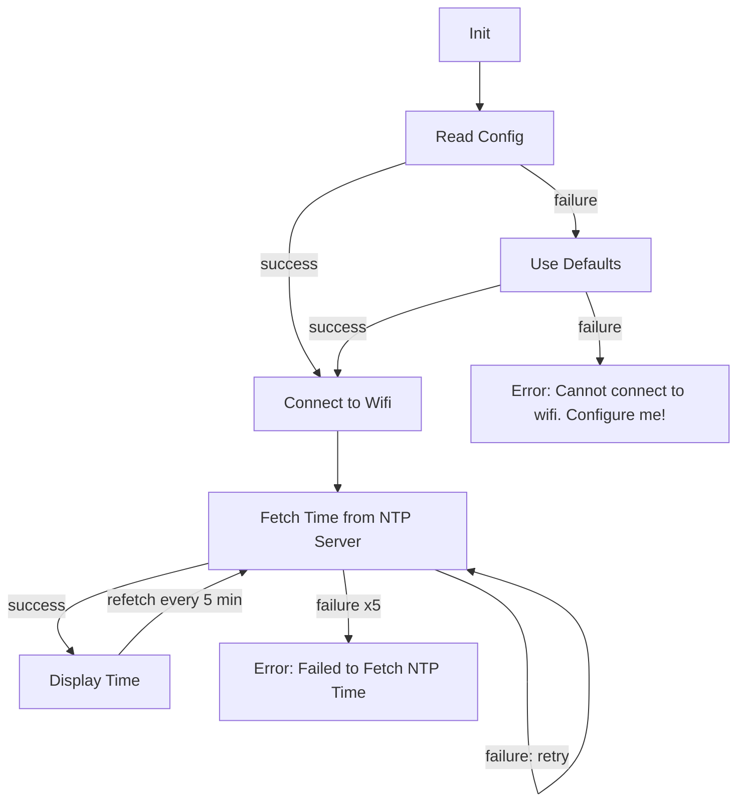
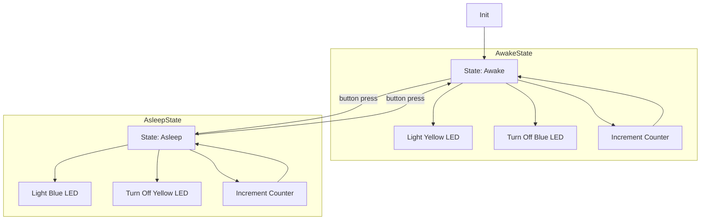

# Program Specs

## Mode and State

The program recognizes three system modes and two system states which represent the configuration of user inputs at any time. THey are,

Modes
- MODE_CONFIG
- MODE_CLOCK
- MODE_TIMER

States
- AWAKE
- ASLEEP

The two states are only used when device is already in MODE_TIMER. The modes have the following meaning:

### MODE_CONFIG

The device needs to be configured.

The device will transmit a Wifi access point for the user to connect to. The user will connect to this AP with their phone or laptop, etc., and the device will serve a ocnfiguration page where the user can input variables. Once the user saves the page, the input data will be written to the EEPROM and stored for later. In this mode the LEDs will be off and the LCD will either be off or show horizontal dashes.

### MODE_CLOCK

The device connects to Wifi and fetches the current time from the internet, then displays that time.

The device will read the config data from the EEPROM and use the Wifi credentials therein to connect to the internet and (attempt to) fetch the time from an NTP server. If NTP fetch fails, it will display "FETCH FAILED" on the LCD; if successful, it will display the current time and count up each second. Device will reconnect every five minutes to recalibrate the internal time to the NTP server.

### MODE_TIMER

The device starts an internal counter and counts up, displaying the current timer on the LCD screen. At the same time, depending on system state, lights up either the yellow AWAKE LED or the blue ASLEEP LED. The system monitors a hardware button for presses, and if pressed, switches the internal system state, resets the counter, and toggles each LED on/off.

## Roadmap

- Add config option to set up a Google sheet or other API endpoint to push data to every time the device is on Wifi.